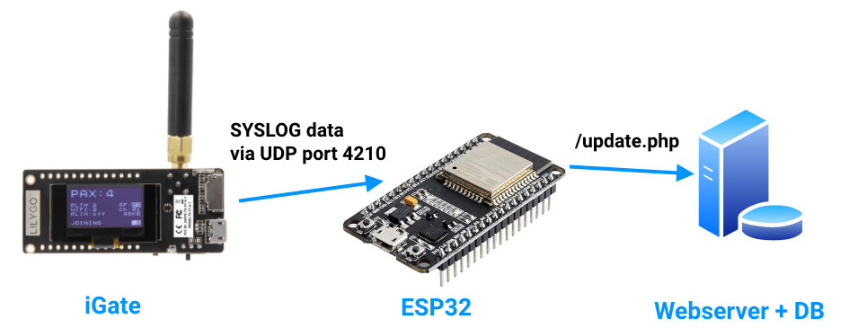
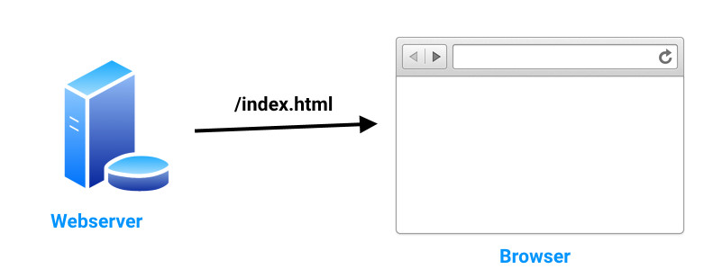

# Introduction

I had had a Lora igate active for some time, but felt that the data from other igates was shown faster or more on sites such as aprs.fi, aprsdirect.de, ...  
But I didn't really have an idea where to start. Until a certain day in July 2022.

Our holiday was over and on the way back to Belgium from Italy we stopped at a motorway car park in Germany. When I went to see where the tracker had been picked up, I saw an igate with a url in it. This made me curious. Just clicked on the link and it was just what I was looking for.

The link : https://aprs.prgm.org/lora-aprs/db0lj.php

Back home, I emailed the site owner asking how he had created this and if I could use some of the code. Unfortunately, the code was not usable but I now had a direction I could work towards.

# Flows
There are essentialy two flows :  
- getting the data from the igate into the database
- viewing everything on a webpage

## Flow 1



## Flow 2



## Changes in is-cfg.json
You have to activate the syslog function on your igate by modifying this entry :

```JSON
 	"syslog": {
		"active": true,              activate this
		"server": "192.168.1.56",    ip adress from my ESP32
		"port": 4210                 port where the ESP32 listens to
	}
```
I know that the port was 514, but 4210 was from an Arduino UDP example and I continued using this :-).  
It is recommended to provide the ESP32 with a fixed IP address in your network. I do this using a DHCP reservation on the MAC address of the controller.

## Database
```MYSQL
CREATE TABLE `igate_data` (
	`call` TINYTEXT NULL DEFAULT NULL COLLATE 'latin1_general_ci',
	`date` DATE NULL DEFAULT NULL COLLATE 'armscii8_bin',
	`time` TIME NULL DEFAULT NULL,
	`destination` TINYTEXT NULL DEFAULT NULL COLLATE 'latin1_general_ci',
	`path` TINYTEXT NULL DEFAULT NULL COLLATE 'latin1_general_ci',
	`rssi` SMALLINT(6) NULL DEFAULT '0',
	`signal` TINYTEXT NULL DEFAULT NULL COLLATE 'latin1_general_ci',
	`snr` DECIMAL(20,2) NULL DEFAULT NULL,
	`payload` TEXT NULL DEFAULT NULL COLLATE 'latin1_general_ci',
	`latitude` DECIMAL(20,6) NULL DEFAULT NULL,
	`longitude` DECIMAL(20,6) NULL DEFAULT NULL,
	`distance` DECIMAL(20,2) NULL DEFAULT NULL
)
COLLATE='latin1_general_ci'
ENGINE=InnoDB
;
```

# Resources
## Disclaimer
All this code is for demonstration purposes only. It should not be considered safe and bug-free. I cannot be held liable for any damage or loss using this code. 
It can be improved and you can do so at your own discretion.

******
